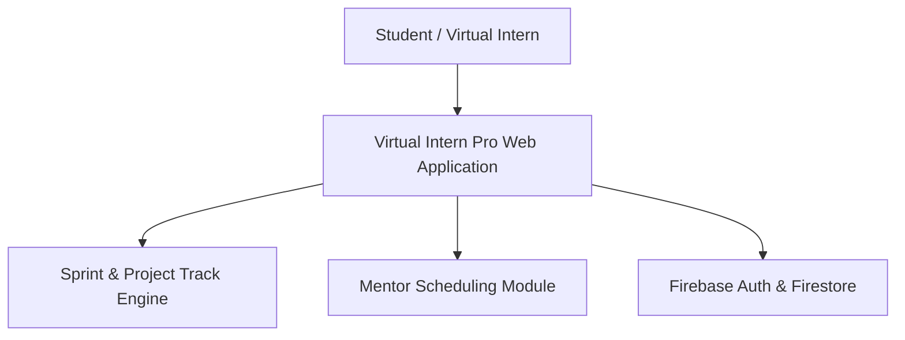
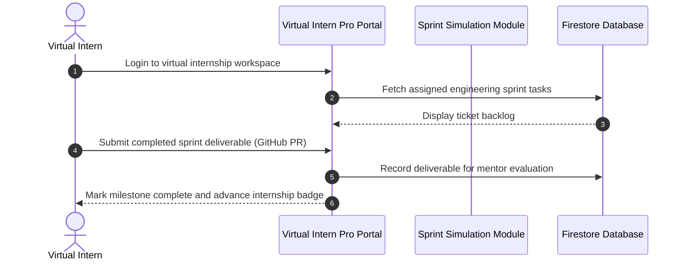

# Virtual Intern Pro — Career Mentorship & Simulation Management
[]()
[]()
[]()
[]()

## Overview
Virtual Intern Pro is an interactive career development, virtual internship simulation, and technical mentorship platform built with Next.js 15, Tailwind CSS, and Firebase. It provides structured milestone-driven project tracks, industry mentor office hours, and simulated engineering deliverables.

- **Problem Solved:** Bridging the experience gap for aspiring engineers without access to formal internships.
- **Target Users:** Students, aspiring developers, technical mentors, and recruiting teams.
- **Current Status:** Functional Web Platform.

## Features
- **Internship Simulation Tracks:** Guided projects simulating real-world engineering sprints.
- **Mentorship Scheduling:** Connect with industry advisors for portfolio and code reviews.
- **Deliverable Submissions:** Submit milestone PRs and artifacts for mentor evaluation.
- **Help & Career Support:** Integrated mentorship FAQs and technical resources.

## Architecture


## User Flow


## Technology Stack
| Layer | Technology | Purpose |
|---|---|---|
| Framework | Next.js 15 (App Router) | Enterprise React application framework |
| Language | TypeScript | Domain type contracts |
| UI | Tailwind CSS, Radix UI, Lucide | Clean professional learning UI |
| Services | Firebase Auth & Firestore | User accounts and deliverable persistence |

## Infrastructure
- **Server Port:** 3000
- **Cloud Backend:** Firebase

## Project Structure
```text
Virtual_Intern_Pro/
├── src/                 # Next.js App Router and UI components
├── components.json      # shadcn/ui configuration
├── package.json         # Dependencies
├── .gitignore           # Git ignore definitions
└── README.md            # Technical documentation
```

## Prerequisites
- Node.js >= 18.x
- Firebase Project

## Environment Variables
Create `.env.local`:
```env
NEXT_PUBLIC_FIREBASE_API_KEY=your_firebase_api_key
NEXT_PUBLIC_FIREBASE_PROJECT_ID=your_firebase_project_id
NEXT_PUBLIC_FIREBASE_APP_ID=your_firebase_app_id
NEXT_PUBLIC_FIREBASE_AUTH_DOMAIN=your_project.firebaseapp.com
```

## Local Development Setup
```bash
git clone https://github.com/Bhanutejanallamothu/Virtual_Intern_Pro.git
cd Virtual_Intern_Pro
npm install
npm run dev
```

## Docker Setup
*Not detected in repository.*

## Database Setup
Firestore collections (`tracks`, `submissions`, `mentors`).

## API Documentation
Next.js server actions.

## Deployment
Deploy to Vercel or Firebase App Hosting:
```bash
npm run build
```

## Security
- Externalized environment variables.
- Submission payload validation.

## Testing
```bash
npm run lint
```

## Troubleshooting
- Check Firebase console settings if authentication fails.

## Future Improvements
- Automated certificate of completion issuance with verifiable digital signatures.

## License
All rights reserved by repository owner.
